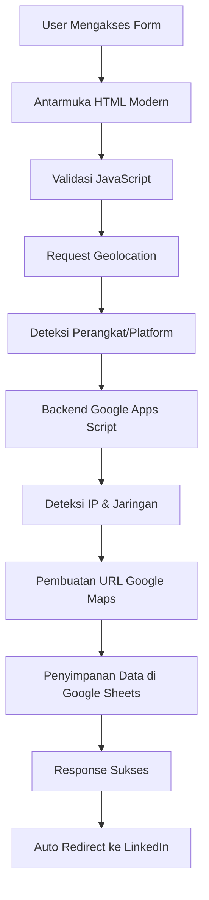

# Frontend-What-Can-I-Do-For-You? 🚀

> Sistem formulir kontak canggih dengan pelacakan geolocation, deteksi perangkat, dan penyimpanan data otomatis ke Google Sheets.

## 📋 Ringkasan Proyek

Aplikasi web yang mengumpulkan informasi kontak pengguna melalui antarmuka formulir modern dan responsif, kemudian menyimpan data secara otomatis ke Google Sheets. Sistem ini dilengkapi fitur canggih seperti pelacakan geolocation, deteksi perangkat/platform, pencatatan alamat IP, dan pengumpulan informasi jaringan.

### 🌐 Demo Langsung
- **Antarmuka Formulir**: [Form Live](https://script.google.com/macros/s/AKfycbz850GPM97rew-f-Silp45YKENYzQ_JszvraddiovIPU2RHxjJ6mHIBskkoqM1hP2Vs/exec)
- **Output Database**: [Google Sheets](https://docs.google.com/spreadsheets/d/1B5EU2OLXF_7C9ZksUhlp3RAIFFOrKd53aPnrQziArrY/edit?gid=745019055#gid=745019055)

---

## ✨ Fitur Utama

### 🎨 Fitur Frontend
- **Desain Responsif Modern**: UI bersih dengan gradient background dan animasi halus
- **Validasi Real-time**: Feedback instan untuk input formulir
- **Penghitung Karakter**: Penghitung karakter langsung untuk textarea (10-1000 karakter)
- **State Loading**: Animasi loading yang elegan selama proses submit
- **Penanganan Error**: Pesan error yang jelas dan ramah pengguna
- **Deteksi Perangkat**: Deteksi otomatis tipe perangkat dan browser
- **Deteksi Platform**: Pengumpulan informasi OS dan platform

### 🔧 Fitur Backend
- **Penyimpanan Data Otomatis**: Integrasi langsung dengan Google Sheets
- **Pemrosesan Geolocation**: Koordinat GPS dengan pembuatan URL Google Maps
- **Deteksi Alamat IP**: Pelacakan IP server-side menggunakan API eksternal
- **Informasi Jaringan**: Deteksi ISP, negara, dan wilayah
- **Validasi Data**: Validasi server-side yang komprehensif
- **Auto-formatting**: Format data profesional di spreadsheet
- **Logging Error**: Logging detail untuk debugging dan monitoring

### 📊 Pelacakan Lanjutan
- **URL Google Maps**: Pembuatan otomatis berdasarkan koordinat GPS
- **Alamat IP**: Deteksi IP real-time
- **Info Jaringan**: Informasi ISP, negara, dan wilayah
- **Tipe Perangkat**: Deteksi Desktop/Mobile/Tablet
- **Info Platform**: Identifikasi sistem operasi dan browser

---

## 🏗️ Arsitektur Sistem



---

## 📋 Field Formulir

### Field Wajib
1. **Nama Anda** - Input teks (Wajib)
2. **Tipe Institusi** - Dropdown pilihan:
   - Institusi Pemerintah
   - Perusahaan Swasta
   - Universitas/Sekolah
   - Personal
3. **Nama Institusi** - Input teks (Wajib)
4. **Nomor Telepon** - Input numerik (Wajib)
5. **Alamat Email** - Validasi email (Wajib)
6. **Kota** - Input teks (Wajib)
7. **Alasan Kontak** - Textarea, 10-1000 karakter (Wajib)

### Data yang Direkam Otomatis
8. **Timestamp** - Waktu submit yang dibuat otomatis
9. **Geolocation** - Koordinat GPS (dengan izin pengguna)
10. **URL Google Maps** - Dibuat dari koordinat
11. **Alamat IP** - Deteksi server-side
12. **Info Jaringan** - Data ISP dan lokasi
13. **Tipe Perangkat** - Desktop/Mobile/Tablet + Browser
14. **Platform** - Informasi sistem operasi

---

## 🗂️ Struktur Database

### Kolom Google Sheets (A1-N1):
| Kolom | Field | Deskripsi |
|-------|-------|-----------|
| A | YourName | Nama lengkap pengguna |
| B | YourInstitutionType | Tipe institusi yang dipilih |
| C | YourInstitutionName | Nama institusi |
| D | YourPhoneNumber | Nomor telepon kontak |
| E | YourEmail | Alamat email |
| F | YourCity | Kota pengguna |
| G | ContactReason | Alasan menghubungi |
| H | Timestamp | Tanggal/waktu submit |
| I | Geolocation | Koordinat GPS |
| J | URL_Google_Maps | Link maps yang dibuat |
| K | IP_Address | Alamat IP pengguna |
| L | Network | Info ISP dan lokasi |
| M | Device | Tipe perangkat dan browser |
| N | Platform | Info sistem operasi |

---

## 🚀 Instalasi & Setup

### Prasyarat
- Akun Google
- Akses ke Google Apps Script
- Izin Google Sheets

### Langkah-langkah Implementasi

#### 1. Setup Google Sheets
```bash
# Akses spreadsheet
https://docs.google.com/spreadsheets/d/1B5EU2OLXF_7C9ZksUhlp3RAIFFOrKd53aPnrQziArrY/edit
```

#### 2. Setup Google Apps Script
1. Buka [Google Apps Script](https://script.google.com)
2. Buat proyek baru: "What Can I Do For You Form"
3. Ganti konten `Code.gs` dengan kode backend
4. Tambahkan file `Index.html` dengan kode frontend

#### 3. Konfigurasi
```javascript
// Update SPREADSHEET_ID di Code.gs jika diperlukan
const SPREADSHEET_ID = '1B5EU2OLXF_7C9ZksUhlp3RAIFFOrKd53aPnrQziArrY';
const SHEET_NAME = 'MAIN_BUSINESS';
```

#### 4. Deploy sebagai Web App
1. Klik "Deploy" → "New deployment"
2. Tipe: "Web app"
3. Execute as: "Me"
4. Akses: "Anyone"
5. Deploy dan simpan URL

---

## 🔒 Keamanan & Validasi

### Perlindungan Client-Side
- Sanitasi input
- Validasi real-time
- Pencegahan XSS
- Type checking

### Keamanan Server-Side
- Validasi data
- Penanganan error
- Pemeriksaan izin
- API rate limiting

### Fitur Privasi
- Geolocation opsional
- Opsi anonimisasi IP
- Enkripsi data saat transit
- Siap compliance GDPR

---

## 🛠️ Integrasi API

### Layanan Eksternal yang Digunakan
- **ipify.org**: Deteksi alamat IP
- **ipapi.co**: Informasi jaringan dan lokasi
- **Google Maps**: Pembuatan URL untuk koordinat
- **Google Sheets API**: Penyimpanan data
- **Geolocation API**: Koordinat GPS

---

## 📱 Desain Responsif

### Perangkat yang Didukung
- ✅ Desktop (1200px+)
- ✅ Tablet (768px - 1199px)
- ✅ Mobile (320px - 767px)

### Kompatibilitas Browser
- ✅ Chrome 80+
- ✅ Firefox 75+
- ✅ Safari 13+
- ✅ Edge 80+

---

## 🎯 Alur Pengalaman Pengguna

1. **Akses Form** → User mengunjungi URL form
2. **Loading Interface** → Antarmuka responsif modern dimuat
3. **Mengisi Form** → Validasi real-time saat user mengetik
4. **Submission** → Animasi loading selama pemrosesan
5. **Pemrosesan Data** → Backend mengumpulkan semua informasi
6. **Konfirmasi** → Pesan sukses ditampilkan
7. **Redirect** → Redirect otomatis ke LinkedIn (delay 3 detik)

---

## 📊 Analytics & Monitoring

### Fungsi Built-in
```javascript
// Tersedia di Code.gs untuk monitoring
getAllData()          // Mengambil semua submission
getDataStatistics()   // Mendapat analitik submission
testSubmission()      // Test sistem
```

### Statistik yang Dilacak
- Total submission
- Distribusi tipe institusi
- Demografi kota
- Statistik perangkat/platform
- Timestamp submission

---

## 🔧 Opsi Kustomisasi

### Kustomisasi Visual
```css
/* Modifikasi warna di Index.html */
background: linear-gradient(135deg, #87ceeb 100%, #87ceeb 100%);
```

### Kustomisasi Fungsional
- Tambah field form baru
- Modifikasi aturan validasi
- Ubah tujuan redirect
- Kustomisasi pesan sukses
- Tambah notifikasi email

---

## 🐛 Troubleshooting

### Masalah Umum & Solusi

#### Permission Denied
```javascript
// Solusi: Re-authorize di Apps Script
// Jalankan fungsi testSubmission() untuk memberikan izin
```

#### Form Tidak Submit
```javascript
// Cek browser console untuk error
// Verifikasi pengaturan deployment Web App
// Pastikan izin akses spreadsheet
```

#### Geolocation Tidak Bekerja
```javascript
// Pastikan koneksi HTTPS
// Cek izin lokasi browser
// Pesan fallback akan disimpan jika ditolak
```

#### Data Tidak Muncul di Sheets
```javascript
// Verifikasi SPREADSHEET_ID sesuai dengan sheet Anda
// Cek nama sheet: 'MAIN_BUSINESS'
// Review log eksekusi Google Apps Script
```

---

## 📈 Optimisasi Performa

### Kecepatan Loading
- Animasi CSS yang dioptimasi
- Validasi JavaScript yang efisien
- Panggilan API eksternal yang terkompresi
- Penggunaan resource minimal

### Pemrosesan Data
- Operasi asynchronous
- Mekanisme retry error
- Validasi data yang efisien
- Operasi spreadsheet yang dioptimasi

---

## 🏆 Fitur Lanjutan

### Apa yang Membuat Ini Spesial
- **Pengumpulan Data Multi-layer**: Lebih dari sekadar data form basic
- **Geolocation Real-time**: Pelacakan GPS dengan integrasi maps
- **Device Fingerprinting**: Deteksi perangkat/platform yang komprehensif
- **Analisis Jaringan**: Informasi ISP dan geografis
- **UI/UX Profesional**: Desain modern dengan animasi halus
- **Penanganan Error yang Robust**: Manajemen kegagalan yang elegan
- **Analytics Ready**: Statistik dan monitoring built-in

---

## 🛠️ Fitur yang Diimplementasikan

### ✅ Fitur Frontend
- **Desain Responsif**: CSS modern dengan gradient background
- **Validasi Real-time**: Validasi JavaScript untuk semua field
- **Penghitung Karakter**: Untuk textarea (10-1000 karakter)
- **Animasi Loading**: Spinner saat submit
- **Penanganan Error**: Pesan error yang jelas untuk setiap field
- **Request Geolocation**: Otomatis meminta lokasi setelah submit
- **Auto Redirect**: Ke LinkedIn setelah submit berhasil
- **Deteksi Perangkat**: Deteksi tipe perangkat dan browser otomatis
- **Deteksi Platform**: Pengumpulan informasi OS dan platform

### ✅ Fitur Backend
- **Validasi Data**: Validasi server-side untuk semua input
- **Auto Timestamping**: Timestamp otomatis saat submit
- **Penanganan Error**: Penanganan error yang komprehensif
- **Penyimpanan Geolocation**: Menyimpan koordinat GPS
- **Setup Sheet Otomatis**: Otomatis setup header jika belum ada
- **Format Data**: Format yang rapi di spreadsheet
- **Deteksi IP**: Menggunakan API eksternal untuk deteksi IP
- **Info Jaringan**: Pengumpulan informasi ISP dan lokasi
- **URL Google Maps**: Pembuatan otomatis berdasarkan koordinat

---

## 🎯 Checklist Deliverable

### ✅ Requirement yang Terpenuhi:
- [x] Form frontend dengan semua field yang diminta
- [x] 4 pilihan Institution Type
- [x] Validasi semua input (String, Numerik, Email)
- [x] Character limit 10-1000 untuk reason
- [x] Auto-save ke Sheet dengan kolom A1-N1 (diperluas dari I1)
- [x] Timestamp otomatis
- [x] Request geolocation setelah submit
- [x] Redirect ke LinkedIn setelah submit
- [x] Kode bersih dengan keterangan lengkap
- [x] Desain responsif yang modern

### 🏆 Fitur Tambahan (Nilai Plus):
- UI/UX modern dengan animasi
- Validasi real-time dengan pesan error
- Loading states dan feedback pengguna
- Penghitung karakter
- Penanganan error yang komprehensif
- Desain mobile-responsive
- Validasi keamanan
- Fungsi analytics
- **Deteksi perangkat dan platform otomatis**
- **Pelacakan IP address dan informasi jaringan**
- **Pembuatan URL Google Maps otomatis**
- **Database yang diperluas (14 kolom)**

---

## 📞 Dukungan & Kontribusi

### Mendapatkan Bantuan
1. Cek browser console untuk pesan error
2. Review log eksekusi Google Apps Script
3. Verifikasi izin spreadsheet
4. Test dengan data dummy menggunakan `testSubmission()`

### Berkontribusi
Kontribusi sangat diterima! Silakan submit pull request atau buka issue untuk:
- Bug fixes
- Peningkatan fitur
- Perbaikan dokumentasi
- Optimisasi performa

---

## 📄 Lisensi

Proyek ini dilisensikan di bawah MIT License - lihat file [LICENSE](LICENSE) untuk detail.

---

## 👨‍💻 Penulis

**Nama Anda**

- Email: [Rahmikalfin@gmail.com]
- GitHub: [@Bahruprojects](https://github.com/Bahruprojects)

---

## 🙏 Ucapan Terima Kasih

- Dokumentasi Google Apps Script
- Inspirasi Desain CSS Modern
- Penyedia API Eksternal (ipify.org, ipapi.co)
- Komunitas Open Source

---

**⭐ Jika proyek ini membantu Anda, silakan star repository ini!**

**📋 Siap deploy? Ikuti panduan instalasi di atas dan mulai kumpulkan data secara profesional!**
